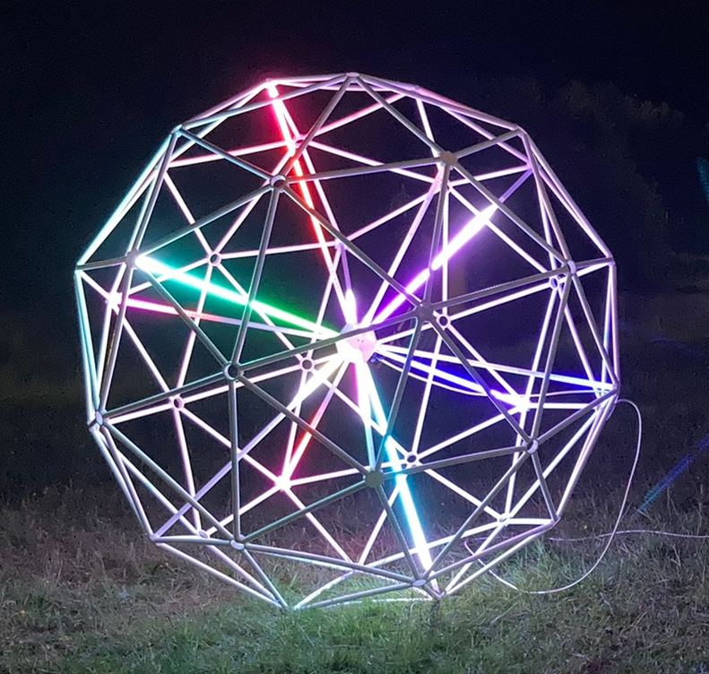
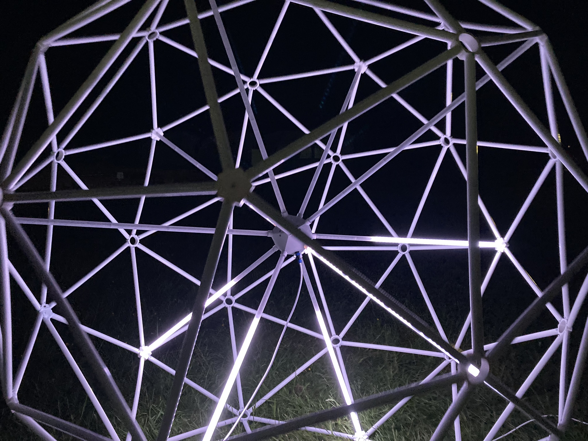
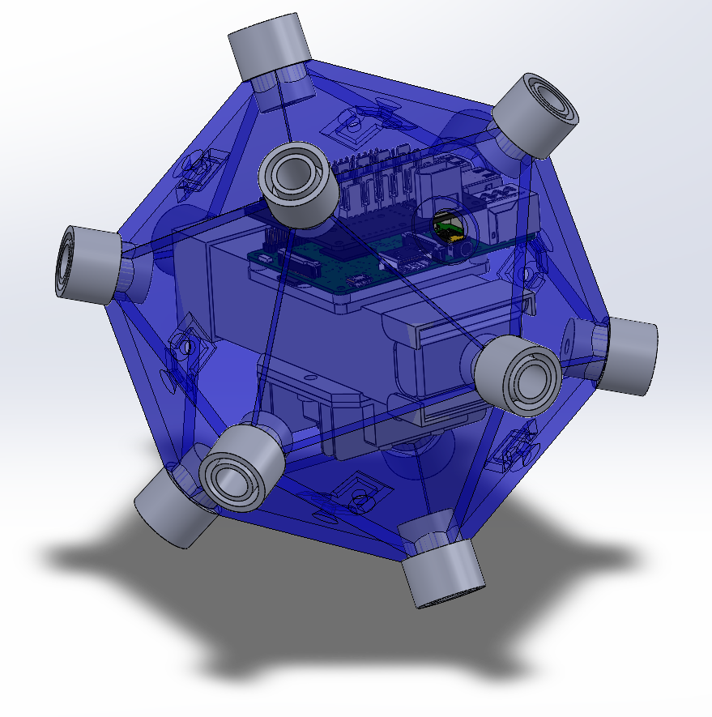
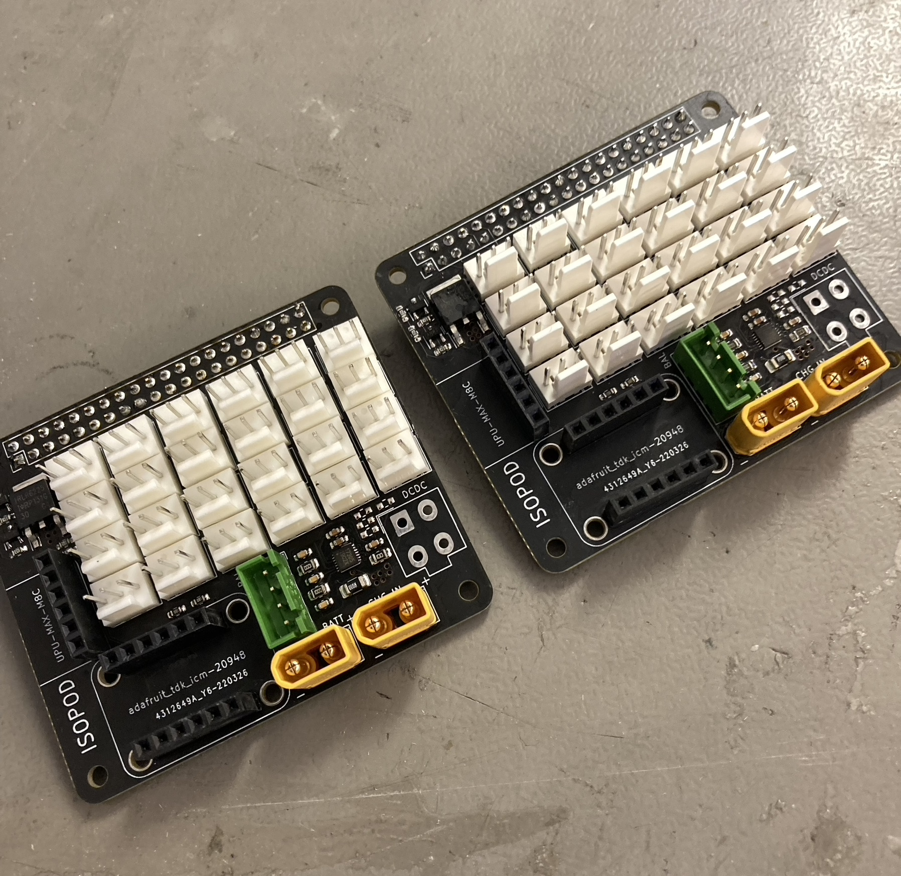
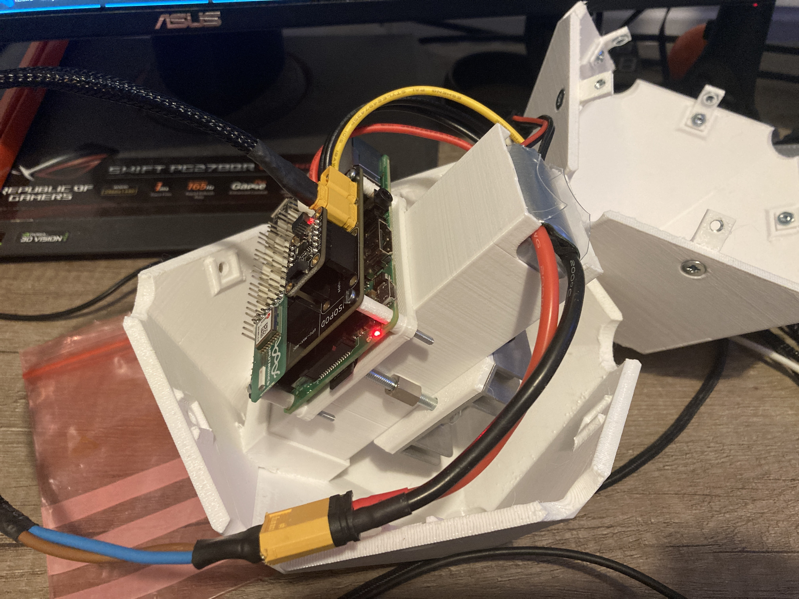

# ISOPOD

ISOPOD is a mobile interactive LED sculpture based on a 2.1m geodesic
isocahedron.  It was displayed at [EMF 2022](https://www.emfcamp.org/).

The outer shell is a 2V geodesic isocahedron made from custom-designed 3d
printed hubs and plastic water pipe.  The core is a regular icosahedron.  12
LED tubes connect to the core's vertices, each made from frosted acrylic tube
and containing a WS2812b addressable LED strip.

The core contains a battery, control electronics, and DC-DC converters.  ISOPOD
is controlled by a Raspberry Pi running software written in Rust.  A custom PCB
mounted on the Pi connects to the battery, DC-DC converters, and LED strips and
adds a battery fuel gauge, GPS module, and 9-axis IMU (accelerometer,
gyroscope, and magnetometer).

ISOPOD was displayed at EMF 2022 with a tether cable (to extend battery life
and avoid it rolling downhill into the lake) but is designed to be totally
wireless, reporting its position and status over Wi-Fi to a backend server.

